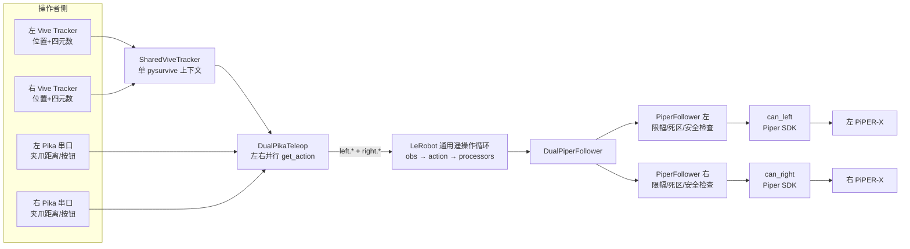

# 双臂遥操作实现原理与代码导览

> 分析基线：2026-08-12，Git `HEAD=6fa2451`。本文中的“当前稳定版”特指
> `piper/config/dual_pika_piper.yaml`；最新的“旋转时冻结平移”仍是专项测试版，
> 位于 `piper/config/dual_pika_piper_x_j5_rotation_lock_test.yaml`。

## 1. 结论先行

当前项目的主要双臂遥操作方案是：

1. 左右手各使用一个 Pika Sense，通过串口读取夹爪开合距离；
2. 两个 Pika 上的 Vive Tracker 通过同一个 `pysurvive` 上下文读取位置和姿态；
3. 左右 Tracker 的相对运动分别映射成左右 PiPER-X 的笛卡尔末端目标：
   `x/y/z + 轴角 rx/ry/rz + gripper`；
4. 左右目标通过键名前缀 `left.`、`right.` 放进同一个 action 字典；
5. 两个 `PiperFollower` 各自只取属于自己的键，做工作空间、死区、跟随误差和单周期限幅；
6. 最后通过两个独立 SocketCAN 接口调用 Piper SDK：
   `ModeCtrl/MotionCtrl_2 + EndPoseCtrl + GripperCtrl`；
7. 机械臂使用 `MOVE_P`，逆运动学和轨迹重规划主要由 Piper 固件完成，当前稳定路径不使用项目内的软件 IK。

它本质上是两套“单手 Pika → 单臂 Piper”通道，外面再用双设备容器进行命名、并发读取和生命周期管理。当前没有双臂协同规划、互碰检测或严格的同时间戳同步。

## 2. 总体数据流



当前稳定配置的并发关系如下：

| 环节 | 当前行为 | 配置/代码 |
|---|---|---|
| 左右 Tracker 采集 | 一个后台线程统一采集并缓存 | `shared_vive_tracker.py` |
| 左右 Pika `get_action` | 并行 | `parallel_read: true` |
| 左右机械臂连接 | 并行 | `parallel_connect: true` |
| 左右机械臂反馈 | 并行 | `parallel_observation: true` |
| 左右机械臂动作下发 | **串行** | `parallel_action: false` |
| 主控制循环目标频率 | 100 Hz | 顶层 `fps: 100` |
| Pika 状态线程目标频率 | 每侧 100 Hz | 每侧 `frequency: 100` |

因此“100 Hz”是期望循环频率，不代表两个 CAN 口一定在同一时刻收到命令。实际频率和左右下发时差还取决于反馈读取、SDK 调用、CAN 总线和 Python 调度。

## 3. 程序如何启动

运行当前稳定版：

```bash
uf-piper-teleop --config_path=piper/config/dual_pika_piper.yaml
```

启动过程如下：

1. `piper/pyproject.toml` 把 `uf-piper-teleop` 注册到
   `lerobot_robot_ufactory_piper.scripts.teleoperate:main`。
2. Python 导入 `lerobot_robot_ufactory_piper` 包时先执行
   `piper/src/lerobot_robot_ufactory_piper/__init__.py`，从而：
   - 导入父项目的 UFACTORY 插件；
   - 注册 `uf::piper`、`uf::dual_piper`、`uf::piper_pika_teleop`、
     `uf::dual_pika_teleop` 等配置类型；
   - 安装双 Tracker 共用上下文补丁。
3. `piper/src/lerobot_robot_ufactory_piper/scripts/teleoperate.py` 不自己实现控制循环，而是调用父项目
   `src/lerobot_robot_ufactory/scripts/uf_robot_teleop.py` 的 `main()`。
4. 父项目解析 YAML，根据 `type` 创建：
   - 一个 `DualPiperFollower`，内部包含 left/right 两个 `PiperFollower`；
   - 一个 `DualPikaTeleop`，内部包含 left/right 两个 `PiperPikaTeleop`。
5. 先连接两台机械臂，再连接两个 Pika。
6. 启动后默认暂停。按下开始键时，先读取两台机械臂的真实末端反馈，然后同时调用左右
   `set_teleop_enabled(True, obs)`。
7. 这一刻的机械臂位姿和 Tracker 位姿分别成为机器人原点与手柄原点，后续发送的是相对运动映射，避免一开始直接跳到 Tracker 的绝对坐标。

父循环每一周期执行：

```text
robot.get_observation()
    → teleop.get_action()
    → teleop_action_processor
    → robot_action_processor
    → robot.send_action()
    → precise_sleep(1 / fps - 本周期耗时)
```

当前没有额外配置 LeRobot processor，所以核心映射和安全处理实际都在 Pika teleoperator 与 Piper follower 内完成。

## 4. 左右通道如何配对

双臂配对不是根据列表位置隐式完成，而是靠统一的 side 名称和键名前缀：

```text
左 Pika  → left.pose.x ... left.pose.rz, left.gripper.pos
右 Pika  → right.pose.x ... right.pose.rz, right.gripper.pos

左 Piper 只提取 left.*
右 Piper 只提取 right.*
```

`DualPikaTeleop.get_action()` 并行读取两侧并合并字典；
`DualPiperFollower.send_action()` 把同一个字典交给两个 follower，每个 follower 的
`_strip_and_validate()` 过滤另一侧键并校验本侧字段是否齐全。

硬件身份也显式固定：

| 侧别 | Pika 串口 | Tracker 持久序列号 | Piper CAN |
|---|---|---|---|
| 左 | `/dev/pika_left` | `LHR-818D4A5D` | `can_left` |
| 右 | `/dev/pika_right` | `LHR-52C31F65` | `can_right` |

串口软链接需要由 udev 绑定物理 USB 口。Tracker 使用 `LHR-*` 持久硬件序列号，不使用可能在进程重启后互换的临时名称 `T20/T21`。

## 5. 为什么两个 Tracker 必须共用读取上下文

原始 Pika SDK 会为每个 Pika 创建自己的 Vive/pysurvive context；两个 context 同时访问 USB 时，第二个可能出现 `LIBUSB_ERROR_BUSY`。同时，每个 context 又都能看见两个 Tracker，容易发生左右误绑定。

`piper/src/lerobot_robot_ufactory_piper/shared_vive_tracker.py` 做了三件事：

1. 全进程只创建一个 `pysurvive.SimpleContext`；
2. 一个后台线程读取全部设备，将最新 pose 同时按临时名称和持久序列号缓存；
3. monkey patch Pika SDK 的 `ViveTracker` 和 `Sense.get_pose()`，让左右 Pika 按各自序列号从共享缓存取数据。

缓存 pose 超过 0.5 秒就被视为失效。失效时不会无限使用陈旧 Tracker 数据；teleoperator 会保持最后一个有效的机械臂目标。

## 6. 平移映射原理

### 6.1 相对控制点

代码先把 Tracker 原点换算成一个操作者控制点：

```text
c(t) = 1000 · scale_xyz · p_tracker(t) + R_tracker(t) · o
```

其中：

- `p_tracker`：Vive 世界坐标下的位置，单位 m；
- `1000`：m 转 mm；
- `scale_xyz`：手部平移到机械臂平移的比例；
- `o`：Tracker 到实际旋转/控制中心的偏移，来源于 `tracker_to_robot_eef[:3]`；
- `R_tracker · o`：偏移随 Tracker 姿态旋转，可消除“纯转腕却产生圆弧假平移”。

当前稳定配置 `tracker_to_robot_eef[:3] = [0, 0, 0]`，因此偏移补偿实际未启用。

### 6.2 坐标轴映射

每次开始遥操作时记录 `c0` 和机械臂真实位置 `p0`。之后目标位置为：

```text
p_target(t) = p0 + A · (c(t) - c0)
```

当前稳定配置：

- `scale_xyz = 0.35`；
- `use_raw_translation_mapping = true`；
- YAML 没有设置左右独立的 `raw_translation_matrix`，所以两侧都使用
  `pika_teleop.py` 内置的 `_RAW_TO_PIPER_TRANSLATION`；
- 该矩阵把 Vive 世界坐标转换为 Piper 基座坐标，目标语义是：
  Pika 向前 → Piper `+X`，Pika 向右 → Piper `-Y`，Pika 向上 → Piper `+Z`。

`dual_pika_piper_measured_translation.yaml` 与后续 J5 配置改成左右各自的实测矩阵并把比例提高到 0.50，但它们不是当前稳定入口。

### 6.3 旋转时冻结平移的试验逻辑

`dual_pika_piper_x_j5_rotation_lock_test.yaml` 额外启用：

```yaml
freeze_translation_while_rotating: true
translation_rotation_lock_speed_rad_s: 0.12
translation_rotation_release_speed_rad_s: 0.04
translation_rotation_release_delay_s: 0.15
translation_rotation_speed_window_s: 0.08
```

它在 80 ms 窗口内根据四元数差计算角速度：

- 角速度达到 0.12 rad/s 时锁住 XYZ；
- 姿态和夹爪仍继续更新；
- 角速度降到 0.04 rad/s 以下并持续 0.15 s 后解锁；
- 解锁时用当前位置重新建立平移零点，避免把转腕圆弧一次性补回造成跳变。

这要求操作者把平移和旋转分开做，不支持自然的边移动边转腕。

## 7. 旋转映射原理

Piper action 中的 `pose.rx/ry/rz` 是轴角向量，单位 rad；Piper SDK 的末端接口使用 RPY 角，单位 degree。项目内部先用轴角做映射和限幅，发送前再转换成 RPY。

当前稳定配置使用 `rotation_style: calibrated`。概念上的处理顺序是：

```text
Tracker 相对旋转
    → 父项目根据 tracker_to_robot_eef 生成一个初步末端姿态
    → 相对当前机械臂姿态取旋转增量
    → 3×3 手势映射矩阵 M
    → 可选主轴提取
    → 一阶滤波
    → rotation_scale
    → 叠加到启用瞬间的机械臂姿态
```

用旋转矩阵表示，核心可近似写成：

```text
R_rel    = R0ᵀ · R_parent_target
w        = Log(R_rel)
w_mapped = M · w
w_filter = α · w_mapped + (1 - α) · w_filter_previous
R_target = R0 · Exp(rotation_scale · w_filter)
```

当前稳定参数：

- `rotation_dominant_axis: false`：不强制只保留最大旋转轴；
- `rotation_filter_alpha: 0.40`：对旋转增量做一阶低通；
- `rotation_scale: 0.60`：手腕旋转幅度缩放到 60%；
- `pose_adaptive_rotation: true`：每次启用时根据机械臂当前姿态重建映射矩阵。

### 7.1 当前配置中一个容易误解的优先级

`dual_pika_piper.yaml` 同时写了：

- `rotation_mapping_matrix`；
- `apply_piper_tool_axis_correction: true`；
- `pose_adaptive_rotation: true`。

但实际代码优先级是：

1. 构造对象时，如果 YAML 提供了 `rotation_mapping_matrix`，先使用它，此时
   `apply_piper_tool_axis_correction` 分支不会执行；
2. 每次 `set_teleop_enabled(True, obs)` 时，只要 `pose_adaptive_rotation=true` 且风格是
   `calibrated`，就再次生成 `_rotation_map`，覆盖前面的显式矩阵。

所以当前稳定版真正进入遥操作后的旋转矩阵主要由 `pose_adaptive_rotation` 决定，YAML 中的显式矩阵和 `apply_piper_tool_axis_correction` 并不是最终生效值。这是后续优化时应优先消除的配置歧义。

J5 专项配置把 `pose_adaptive_rotation` 设为 `false`，因此左右实测的
`rotation_mapping_matrix` 才会按 YAML 原值生效。

## 8. 夹爪映射原理

当前稳定版不采用父项目面向 xArm 的反向夹爪映射，而是直接读取 Pika 的物理开口距离：

```text
u_raw = clamp((distance_mm - 0.4) / (98.1 - 0.4), 0, 1)
```

含义是 `0 = 闭合`、`1 = 张开`，与 Piper 夹爪方向一致。之后依次进行：

1. 最近 3 帧中值滤波；
2. 误差超过 0.005 时，以 `alpha=0.75` 追踪目标；
3. 每次最大变化量限制为 0.15；
4. follower 将 `u` 变为 0～100%；
5. `PiperMotorsBus` 根据标定范围映射到 0～68000；
6. SDK 调用 `GripperCtrl(raw, 1000, 0x03, 0)`。

Follower 最多每 0.03 s 下发一次夹爪命令，并以 0.03 s 周期保活。`ctrl_code=0x03` 表示启用夹爪并清除夹爪错误。

## 9. 机械臂端如何执行和保护

每一侧 `PiperFollower` 先读取 Piper 当前末端反馈：

- SDK 位置单位为 0.001 mm，除以 1000 后变成 mm；
- SDK 姿态单位为 0.001 degree，除以 1000 后变成 degree；
- degree RPY 被转换成 rad 轴角，和 Pika action 对齐。

当前稳定配置的笛卡尔保护顺序为：

1. **工作空间裁剪**
   - `X: [50, 600] mm`
   - `Y: [-500, 500] mm`
   - `Z: [50, 600] mm`
2. **独立死区**
   - 平移误差 ≤ 5 mm 时保持当前 XYZ；
   - 旋转误差 ≤ 0.020 rad 时保持当前姿态；
   - 两者分开判断，纯转腕时不会因为小幅位置噪声拖动整条手臂。
3. **大偏差保护**
   - 相对当前反馈的目标平移超过 300 mm，或旋转超过 2.0 rad 时，本周期保持当前位姿。
4. **direct 模式单周期限幅**
   - 平移最多前进 15 mm；
   - 轴角向量最多前进 0.18 rad。
5. **发送到固件**
   - 轴角转回 RPY degree；
   - `move_mode=move_p` 对应 SDK mode code `0x00`；
   - `move_speed_percent=55`；
   - 值乘 1000 转回 SDK 整数单位；
   - 调用 `EndPoseCtrl`。

`cartesian_command_mode: direct` 并不等于完全无保护直通。它仍然受工作空间、死区、跟随误差和 `direct_max_step_*` 约束；区别是每周期从当前反馈朝完整目标靠近，而不是使用旧版更保守的固定 step 路径。

当前配置 `configure_role_on_connect=false`、`piper_init_on_connect=false`，说明启动时刻意跳过 SDK 的角色重配和完整初始化，但仍会执行 `enable_torque_on_connect=true`。这要求 CAN、机械臂角色和上电状态事先正确。

退出时 `disable_torque_on_disconnect=false`、`hold_position_on_disconnect=true`：程序会先把当前反馈位姿重新下发一次，然后断开接口但不主动卸力。该行为适合保持姿态，但也意味着程序退出不等于机械臂失能。

## 10. 暂停、恢复与掉线行为

### 暂停/重新开始

双 Pika 由父控制循环作为一个整体启停。子 Pika 自己的硬件按钮状态线程不会单独改变左右侧启停状态，避免一侧开始、一侧暂停。

重新开始时：

- 读取左右机械臂当前真实反馈；
- 重置 Tracker 起点、平移映射起点、旋转滤波状态和夹爪滤波状态；
- 从真实机械臂位置建立新相对坐标原点。

因此操作者可以在暂停后调整手的位置，再重新建立“手—机械臂”对应关系。

### Tracker 短暂掉线

- 共享 Tracker 缓存超过 0.5 s 返回 `None`；
- 平移保持最后有效目标；
- 原始 Pika action 缓存也保持最后动作；
- 夹爪串口首帧失败时保持启用瞬间机械臂真实开口，后续短时失败保持最后有效值。

当前没有独立的“输入数据超时后自动停机/卸力”状态机，只是保持上一个目标。

## 11. 另一套双臂方案：Piper leader → Piper follower

项目还提供 `piper/config/dual_piper_leader_follower.yaml`。它不是当前双 Pika 稳定入口，原理也不同：

```text
左 Piper leader 的 6 关节+夹爪 → left.joint*.pos → 左 Piper follower JointCtrl
右 Piper leader 的 6 关节+夹爪 → right.joint*.pos → 右 Piper follower JointCtrl
```

特点：

- 共需要 4 个独立 CAN 接口；
- leader 通过 `MasterSlaveConfig(0xFA, ...)` 设置角色；
- follower 通过 `MasterSlaveConfig(0xFC, ...)` 设置角色；
- 读取的是 SDK 的 leader control joint 消息；
- 关节被归一化到 `[-100, 100]`，夹爪为 `[0, 100]`；
- follower 下发前用 `max_relative_target: 3.0` 限制相对当前关节的单次变化；
- 最终调用 `JointCtrl`，而不是 `EndPoseCtrl`；
- 不使用 Pika、Vive、坐标映射或笛卡尔 IK。

这套配置仍含相机占位路径和通用任务占位内容，更像可用模板，不应与当前已调好的双 Pika 配置等价看待。

## 12. 当前真正用到的文件

### 12.1 当前稳定双 Pika → 双 Piper 运行必经文件

| 文件 | 作用 |
|---|---|
| `piper/config/dual_pika_piper.yaml` | 当前稳定硬件身份、映射、滤波、限幅和频率参数 |
| `piper/pyproject.toml` | 安装依赖并注册 `uf-piper-teleop` 命令 |
| `piper/src/lerobot_robot_ufactory_piper/__init__.py` | 导入并注册所有 Piper/Pika 类型；安装共享 Tracker 补丁 |
| `piper/src/lerobot_robot_ufactory_piper/scripts/teleoperate.py` | 薄入口，转给父项目通用循环 |
| `piper/src/lerobot_robot_ufactory_piper/config.py` | 双/单 Piper、双/单 Pika 配置类与参数校验 |
| `piper/src/lerobot_robot_ufactory_piper/pika_teleop.py` | 平移、旋转、夹爪映射；双 Pika 并行读取与左右 action 合并 |
| `piper/src/lerobot_robot_ufactory_piper/shared_vive_tracker.py` | 双 Tracker 单 context 采集、序列号绑定、0.5 s 新鲜度检查 |
| `piper/src/lerobot_robot_ufactory_piper/piper_follower.py` | 反馈读取、安全处理、左右 action 拆分和双臂生命周期 |
| `piper/src/lerobot_robot_ufactory_piper/pose.py` | 轴角/RPY、J6/TCP 变换、旋转距离、裁剪和向量限步 |
| `piper/src/lerobot_robot_ufactory_piper/motors/piper_motors_bus.py` | Piper SDK/SocketCAN 适配，读取反馈并发送末端、关节、夹爪命令 |
| `piper/src/lerobot_robot_ufactory_piper/motors/tables.py` | 关节/夹爪范围、归一化方式和停车位 |
| `src/lerobot_robot_ufactory/scripts/uf_robot_teleop.py` | YAML 构造、连接、启停和 100 Hz 主循环 |
| `src/lerobot_robot_ufactory/teleoperators/pika_teleop/pika_teleop.py` | 原始 Pika 相对位姿计算，被 Piper 子类复用并修正 |
| `src/lerobot_robot_ufactory/teleoperators/pika_teleop/pika_teleop_config.py` | 原始 Pika 基础配置 |
| `src/lerobot_robot_ufactory/devices/pika/pika_device.py` | Pika 串口、Sense 和 Tracker 设备初始化 |
| `src/lerobot_robot_ufactory/devices/umi/vive_tracker/transformations.py` | 齐次矩阵、四元数、轴角与 RPY 数学变换 |

此外还依赖外部包 `lerobot==0.4.3`、`piper_sdk`、`wego_piper`、`pika`/`pysurvive`、NumPy 和 PyYAML。

### 12.2 替代方案和专项实验文件

| 文件 | 状态/用途 |
|---|---|
| `piper/config/dual_pika_piper_measured_translation.yaml` | 左右独立实测平移矩阵，比例 0.50 |
| `piper/config/dual_pika_piper_x_j5_test.yaml` | 左右独立 J5 旋转矩阵，实机专项版 |
| `piper/config/dual_pika_piper_x_j5_rotation_lock_test.yaml` | 最新旋转冻结平移试验版 |
| `piper/config/dual_pika_piper_x_j5_preview.yaml` | 软件 IK/J5 只读预览，不发运动命令 |
| `piper/config/dual_pika_piper_verified_axes.yaml` | 低速旧回退参数 |
| `piper/config/dual_pika_piper_preflight.yaml` | 低幅度硬件预检 |
| `piper/config/dual_piper_leader_follower.yaml` | 四 CAN 的双 Piper 主从方案模板 |
| `piper/src/lerobot_robot_ufactory_piper/piper_leader.py` | 单/双 Piper leader 读取 |
| `piper/src/lerobot_robot_ufactory_piper/piper_joint_stream.py` | 软件 IK 目标到关节流；当前只应作 dry-run 预览 |
| `piper/src/lerobot_robot_ufactory_piper/piper_kinematics.py` | NumPy FK/IK |
| `piper/urdf/piper_x_kinematic.urdf` | PiPER-X 软件运动学模型 |
| `piper/urdf/piper_description.urdf` | 旧/通用 Piper 描述 |

### 12.3 标定、诊断和测试文件

| 文件 | 作用 |
|---|---|
| `piper/tools/identify_dual_pika_trackers.py` | 识别左右 Tracker 持久序列号 |
| `piper/tools/measure_pika_piper_mapping.py` | 实测平移/旋转轴映射矩阵 |
| `piper/tools/calibrate_tracker_offset.py` | 标定 Tracker 到旋转控制点的偏移 |
| `piper/tools/monitor_piper.py` | 只读监控关节和末端反馈 |
| `piper/tools/verify_ik_fk.py` | FK/IK 与手眼关系校验 |
| `piper/tools/verify_piper_x_model.py` | PiPER-X 模型验证 |
| `piper/tests/test_pika_tracker_control_point.py` | 验证控制点偏移能抵消转腕圆弧 |
| `piper/tests/test_pika_rotation_translation_gate.py` | 验证旋转冻结/迟滞/释放逻辑 |
| `piper/tests/test_piper_x_j5_mapping.py` | 验证左右 J5 映射与专项配置继承关系 |
| `piper/tests/test_piper_x_kinematics.py` | 验证 PiPER-X FK/IK |

## 13. 当前实现的边界和风险

1. **没有双臂互碰保护**：两侧只做各自 XYZ 盒状工作空间裁剪，两个工作空间相互重叠；系统不知道另一只手臂、夹爪或环境障碍物的位置。
2. **动作不是严格同步下发**：当前 `parallel_action=false`，左右 SDK 调用串行；即便改成并行，也还没有统一时间戳或硬件触发。
3. **输入不是原子快照**：左右 `get_action()` 虽然并行，但各自会读取共享缓存，并且单侧平移/旋转路径可能多次读取 pose；没有保证所有计算来自完全同一采样时刻。
4. **无独立 watchdog/急停接入**：Tracker 陈旧时保持旧目标；`PiperMotorsBus` 虽有 `emergency_stop()`，主控制循环没有绑定急停按钮、超时或异常策略。
5. **旋转配置存在覆盖歧义**：稳定配置里的固定矩阵、工具轴修正和自适应矩阵并非同时叠加，实际由代码分支覆盖。
6. **旋转限步是轴角向量欧氏限步**：它不是严格的 SO(3) 测地线限速；接近较大角度或轴角表示边界时可能不够理想。
7. **控制频率缺少实测指标**：目前没有持续记录循环周期、Tracker 年龄、左右 CAN 下发时差、目标/反馈误差和丢帧率。
8. **断开不等于失能**：当前稳定配置退出后保持扭矩；必须把软件退出、保持、软急停和硬急停的语义区分清楚。
9. **MOVE_P 依赖固件 IK**：优点是稳定并避免已出现过的关节流抖动；代价是软件端难以显式约束肘姿、奇异位形和双臂协同轨迹。

## 14. 后续优化建议顺序

### P0：先建立可复现、安全的基线

1. 为每周期记录：循环耗时、左右 Tracker 时间戳/年龄、左右 action、左右反馈、限幅原因和 CAN 下发时差。
2. 把 `rotation_mapping_matrix`、`apply_piper_tool_axis_correction`、
   `pose_adaptive_rotation` 改成明确互斥或明确组合的模式，启动时打印最终有效矩阵。
3. 接入输入超时 watchdog、软件急停和明确的退出策略；实机始终保留独立硬急停。
4. 给左右臂设置合理的非对称安全区，并增加最低限度的末端间距/机身互碰保护。

### P1：提高双臂同步性

1. 让共享 Tracker 层一次返回左右 pose 的同时间戳快照，单侧计算只读取一次 pose。
2. 测量 `parallel_action=false` 的真实左右时差；确认 SDK 和两个 SocketCAN 接口线程安全后，再评估并行动作下发。
3. 给动作和反馈附带时间戳，避免只依赖字典合并造成“看起来同步”。

### P2：改善映射与手感

1. 以左右独立实测平移矩阵替代共享矩阵，并完成 Tracker 控制点偏移标定。
2. 比较“固定实测旋转矩阵”和“姿态自适应矩阵”，不要在同一配置中隐式覆盖。
3. 在 SO(3) 上进行旋转滤波和测地线限速，分别控制角速度与角加速度。
4. 将“转腕冻结平移”从二选一试验改成可调的意图分离/去耦策略，逐步恢复边平移边旋转能力。

### P3：再评估执行层

1. 先保留已验证的 `MOVE_P + EndPoseCtrl` 作为安全基线。
2. 若需要控制肘姿、奇异位形或双臂协同，再建立离线仿真、限速、碰撞检测和失稳回退后评估软件 IK；不要直接恢复曾在实机出现严重抖动的关节流。

## 15. 后续修改时的参数定位速查

| 想调整的问题 | 首先查看 |
|---|---|
| 手移动太快/太慢 | `scale_xyz`、`raw_translation_matrix` |
| 前后左右上下方向错误 | `raw_translation_matrix` |
| 转腕方向或 J5/J6 不对 | `rotation_mapping_matrix`、`pose_adaptive_rotation`、`rotation_style` |
| 转腕幅度太大/太小 | `rotation_scale` |
| 转腕抖动/延迟 | `rotation_filter_alpha`、`rotation_deadband_rad` |
| 转腕带来假平移 | `tracker_to_robot_eef[:3]` 控制点偏移，或 rotation-lock 参数 |
| 机械臂响应太激进 | `direct_max_step_mm/rad`、`move_speed_percent` |
| 机械臂不动但日志有目标 | `translation_deadband_mm`、`rotation_deadband_rad`、following error、CAN 状态 |
| 夹爪抖动/滞后 | `gripper_filter_window/alpha/deadband/max_step` |
| 左右不同步 | `parallel_action`、主循环耗时、Tracker/动作时间戳 |
| 退出后的机械臂状态 | `disable_torque_on_disconnect`、`hold_position_on_disconnect` |

## 16. 推荐的后续开发基线

在没有新一轮实机验证结果前，建议保留以下分层：

- `dual_pika_piper.yaml`：稳定回退基线，不直接加入高风险试验；
- 新配置文件：每次只改变一个可验证因素，例如同步、旋转映射、控制点补偿或安全策略；
- 对纯数学映射和状态机先补单元测试；
- 对会发 CAN 运动命令的改动先提供 dry-run/只读预览；
- 实机测试记录配置文件、Git 提交、左右硬件 ID、初始位姿和日志指标。

这样后续优化双臂版本时，可以明确判断改善来自哪一个变量，并且始终有可回退的稳定控制链路。
